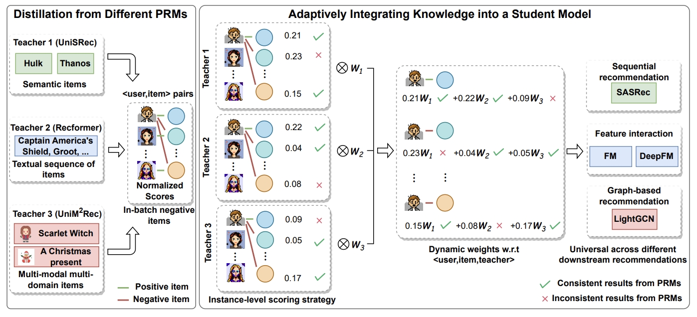

## Overview

we propose **PRM-AMD**, which stands for an efficient ensemble of different **P**re-trained **R**ecommendation **M**odels with **A**daptive **M**ulti-teacher **D**istillation. Aiming to selectively integrate the informative knowledge distilled from heterogeneous PRMs into a student model.

## Note
Due to the policy in the industrial incorporation where the code belongs to, we will release the complete code and data after the reviewing period.

